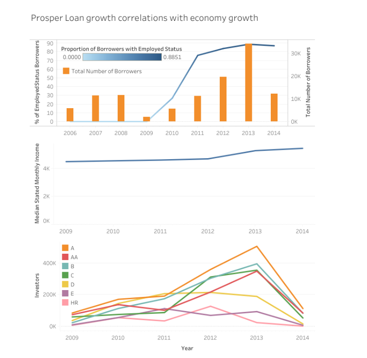

# Udacity-Term-2-Data-Story-using-Tableau
Data Exploration using Prosper Loan data

An explanatory data visualization from a data set that communicates a clear finding or that highlights relationships or patterns in a data set. This work is a reflection of the theory and practice of data visualization, and final deliverable is produced in the form of a write up along with a Tableau Public workbook.
Click below to see the work done in Tableau:

[Data story using Prosper Loan data](https://public.tableau.com/profile/varsha.raj#!/vizhome/ProperLoanAnalysis/DataStoryFinal)

